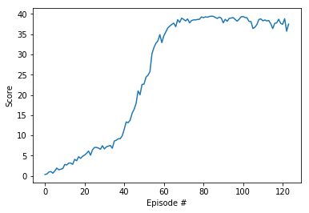

# Reacher Agent
  
### Goal
Train an agent (double-jointed arm) to move to target locations.

### Agent Implementation
Deep Determenistic Policy Gradients (DDPG) is prefered over DQN, because it is more suitable for continuous state and action spaces, whereas DQN is more suitable for discrete spaces.

The Critic (Value-based) model computes the Q-values for any given (state, action) pair. After that, the gradient of the approximated Q-function is computed with respect to the corresponding action vector which in turn is the input for Actor (Policy-based) model.

### Code implementation

The code was modified from the "DDPG pendulum" tutorial from a the Udacity Deep Reinforcement Learning Repo.

The modifications are as follows:
- model.py: This file implements the Q-Network with the standard feed forward architecture.
  - Both critic and actor are 3-layered feed forward networks with ReLU activations.
  - To have more stable and faster convergence, we added a batchnorm layer after the input layer
  
- agent.py: This file implements the learning agent itself along with the replay buffer and exploration noise.
  - The first modification was to introduce a defined interval for the learning procedure.
  - Second, the agent was modified to run simultaneously on multiple environments by having a shared buffer replay from which all agents can read and write.

The rest of the code remains nearly unchanged.

### DDPG parameters and results

The DDPG agent uses the following parameters values (defined in ddpg_agent.py)

```
BUFFER_SIZE = int(1e6)  # replay buffer size
BATCH_SIZE = 128        # minibatch size
GAMMA = 0.95            # discount factor
TAU = 1e-3              # for soft update of target parameters
LR_ACTOR = 1e-4         # learning rate of the actor 
LR_CRITIC = 1e-3        # learning rate of the critic
WEIGHT_DECAY = 0        # L2 weight decay
TRAIN_EVERY = 20        # How many iterations to wait before updating target networks
NUM_AGENTS = 20         # How many agents are there in the environment
```



The 20 agents were able to obtain +30.0 average reward for 100 episode in 124 episodes.

### Future work
- Investigate other Actor-Critic methods such as PPO or A3C.
- Implement D4PG (the distributed version of DDPG).
